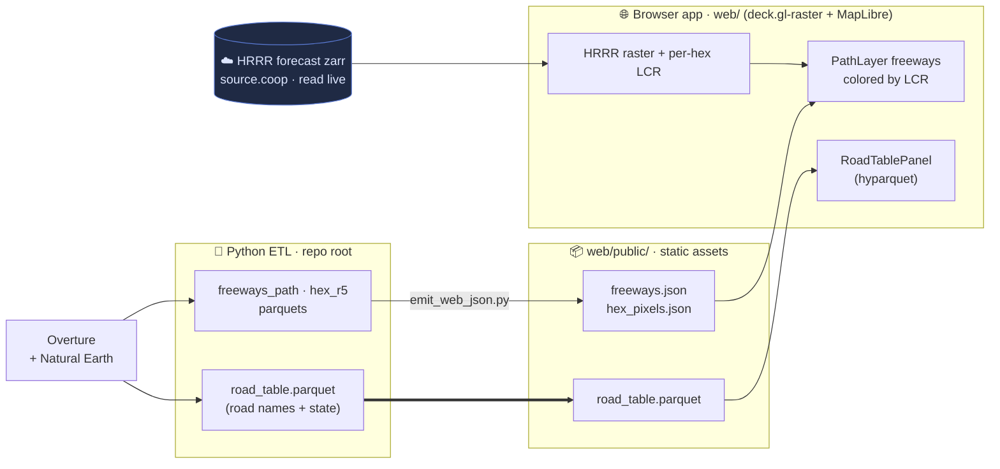

# Zarr Road Risk - CONUS

**Live: <https://kentstephen.github.io/zarr-road-risk/>**

*Claude wrote the code and documentation under my supervision. I have been experimenting with using Claude to build instruments for data visualization with natural language.*

Live road-weather hazard viewer: NOAA **HRRR** forecast rasters rendered in the
browser, with US freeways colored by **LCR** (Loss-of-Control Risk, the 0–12
icy-road driving-hazard scale — <https://icyroadsafety.com/lcr/>). A right-side
panel lists the roads currently at risk, grouped by state, updated live as the
forecast animates.

The HRRR store is read directly from the cloud per frame (no server, no
pre-render); the freeway geometry and the road/state lookup ship as small static
assets built by the Python ETL.

## How it fits together



The parquet/JSON in `web/public/` are **forecast-independent** (geometry + grid
indices don't depend on init time) — built once, not per deploy.

## Run

**Web app** (see [`web/README.md`](web/README.md) for details):

```sh
cd web && npm install && npm run dev      # http://localhost:3000
```

**Python ETL** (managed by [`uv`](https://docs.astral.sh/uv/)):

```sh
uv sync
uv run python scripts/build_road_table.py   # -> data/ + web/public/road_table.parquet
uv run python scripts/emit_web_json.py       # -> web/public/{freeways,hex_pixels}.json
```

The same `road_table.parquet` the browser reads is queryable on the CLI:

```sh
duckdb -c "SELECT state, count(*) FROM 'web/public/road_table.parquet'
           WHERE road_name IS NOT NULL GROUP BY state ORDER BY 2 DESC"
```

## Deploy

Static build to GitHub Pages. `vite build` sets `base` to `/zarr-road-risk/`
and copies `web/public/` (parquet + JSON) into `web/dist/`:

```sh
cd web && npm run build       # -> web/dist/
```

## Layout

- `web/` — standalone browser app (Vite + React + deck.gl), its own `package.json`.
- `scripts/` — ETL + verification (`build_road_table.py`, `emit_web_json.py`, `verify_lcr.py`, …).
- `docs/` — design/planning notes.
- `*.ipynb` — exploration + the freeway-parquet build notebook.
- `data/` — generated parquets (gitignored).
